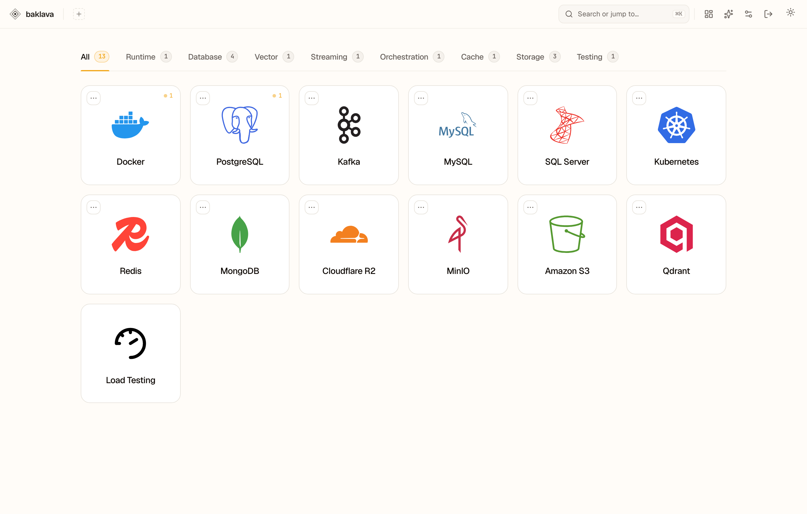
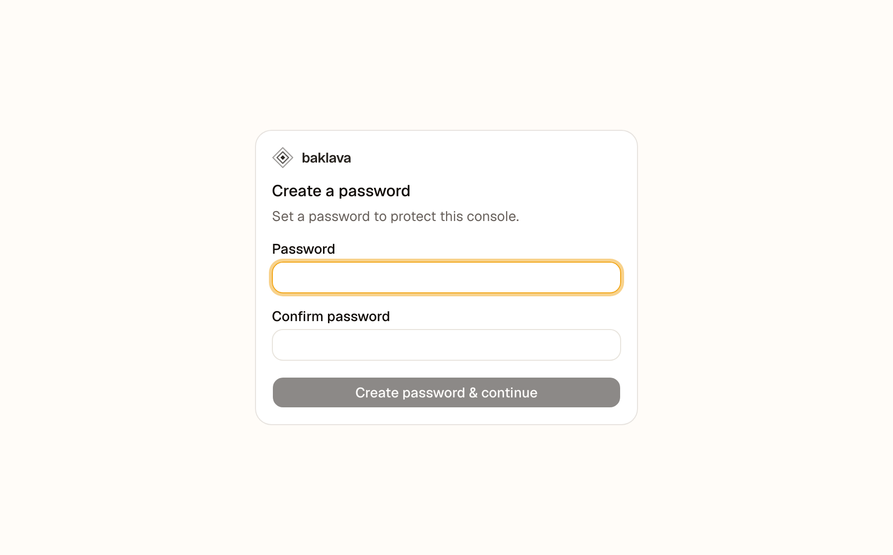
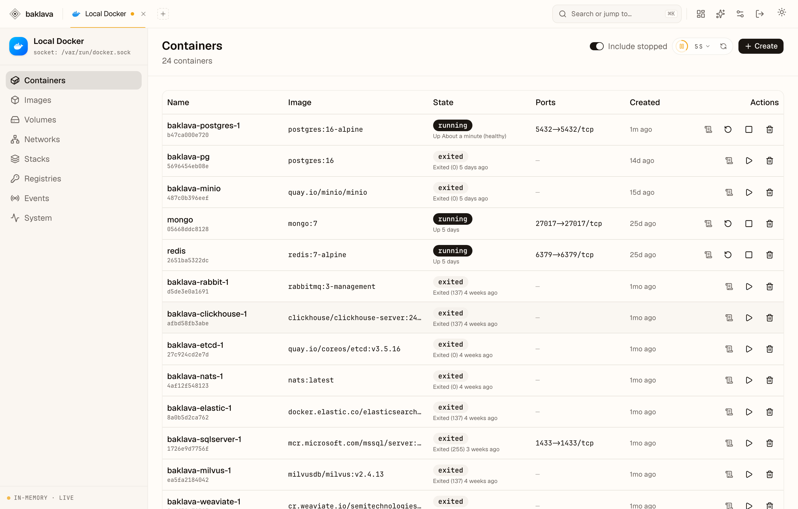
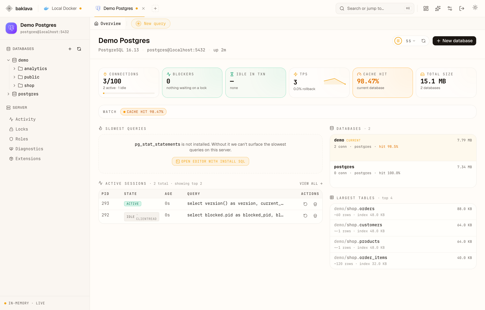
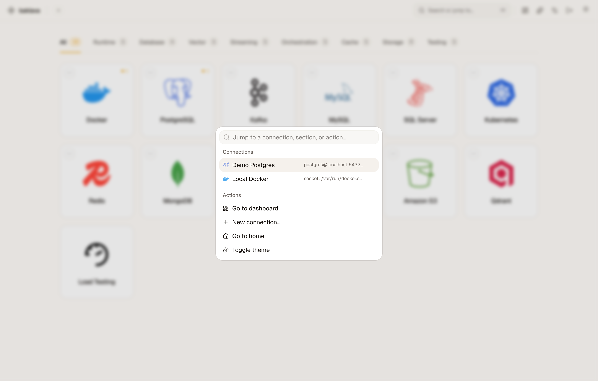

# Baklava

**One console for your whole backend.**

Baklava is a free, open-source dashboard for the infrastructure you already run — Docker, databases, Kafka, Kubernetes, Redis, object storage, and more. Each one gets a workspace modeled on the dedicated app you'd normally reach for, so you stop juggling Docker Desktop, pgAdmin, kafka-ui, RedisInsight, an S3 browser, and a dozen browser tabs. It all lives in one place, on your machine.



---

## Get started in two minutes

You need [Node.js](https://nodejs.org) 20+ and (optionally) [Docker](https://www.docker.com/products/docker-desktop/).

```bash
npm install
npm run dev
```

Open **http://localhost:3000**.

The first time you open Baklava, it asks you to **create a password**. There's no default — you pick one, and it's stored (hashed) only on your machine. Any password works; there are no length rules.



That's it. Docker works immediately. For everything else, you add a connection in the UI.

---

## How to use it

**1. Pick a technology** from the home grid and add a connection. You fill in the host, port, and credentials, then hit **Test** — a successful test saves it. (Docker needs nothing; it uses your local Docker automatically.)

**2. Open the connection** to land in a full workspace — sidebar, tables, detail views — shaped like the tool you already know.

For example, the **Docker** workspace is a Portainer-grade view of your containers, images, volumes, networks, and stacks, with logs, stats, and a real terminal one click away:



And the **PostgreSQL** workspace feels like pgAdmin — a live health dashboard, a schema tree, table browsers, and a SQL editor with autocomplete:



**3. Jump anywhere with ⌘K.** Press **⌘K / Ctrl+K** (or the search pill in the header) to hop to any connection, section, or object, or to run quick actions like adding a connection or toggling the theme.



---

## What's integrated

| Category | Technologies | Modeled on |
|---|---|---|
| **Runtime** | Docker | Docker Desktop / Portainer |
| **Database** | PostgreSQL · MySQL · SQL Server · MongoDB | pgAdmin · phpMyAdmin · SSMS · Compass |
| **Streaming** | Kafka | kafka-ui |
| **Orchestration** | Kubernetes | k9s |
| **Cache** | Redis | RedisInsight |
| **Vector** | Qdrant | — |
| **Object storage** | Cloudflare R2 · MinIO · Amazon S3 | an S3 file browser |

Each workspace gives you the everyday operations you'd expect: browse and edit data, run queries, watch logs and metrics, manage objects, and perform the destructive actions (drop, delete, prune) behind clear confirmations.

---

## Your data stays on your machine

Baklava has no cloud, no account, and no telemetry. Connections are saved to `~/.baklava/connections.json` (readable only by you) so they survive restarts. Set `BAKLAVA_DATA_DIR` to store them somewhere else.

### Credential encryption at rest

Connection and load-test secrets in `~/.baklava/*.json` are encrypted with **AES-256-GCM** before being written to disk. The master key is resolved in this order:

- `BAKLAVA_MASTER_KEY` env var — recommended for Docker or headless deployments; set it and you control the key.
- OS keychain (`@napi-rs/keyring`, installed automatically if supported) — the key is stored in your system credential store.
- `~/.baklava/master.key` (0600, auto-generated) — used as a fallback; provides no real protection on its own if the file is accessible. Set the env var or use a keychain for stronger guarantees.

On first save after upgrading, any existing plaintext file is backed up to `<file>.pre-encryption.bak`. Verify your connections still work, then delete the backup.

Run `npm run baklava:show-key` to display the active master key for safekeeping. **Losing the key means re-entering all connections** — credentials cannot be recovered without it.

### The password gate

Because Baklava can read every stored credential and run destructive queries, it sits behind a **single shared password** (one password, no usernames) whenever it's reachable over a network.

- **You create the password on first run** — there is no default to forget or leak.
- **Change it** anytime in **Settings → Security**, and use **Lock console** in the header to sign out.
- **Turn the gate off** in **Settings → Security** if you're on a trusted machine and the prompt is just friction. Leave it **on** for anything exposed to a network.
- Prefer to set it up front? Start with `BAKLAVA_INITIAL_PASSWORD='your-password' npm run dev` to skip the create-password screen.

The password is hashed (scrypt) and stored in `~/.baklava/auth.json`. It never leaves the server.

### Users & roles

Baklava supports **multiple users**. Each user has a username, a password, and a **role**:

- **admin** — full control: manages users, sees and edits every connection, and changes console-wide settings.
- **member** — can only use the connections an admin has granted them, and never sees the **Users** tab.

**Per-connection access.** A connection's owner and any admin always have full (write) access. For everyone else an admin grants **read** or **write** per connection — members only see connections they've been granted, and can't reach others even by guessing the URL.

**Logging in.** You sign in with a **username and password**. As a convenience, while there's only **one** user the login page accepts the password alone (no username needed).

**Upgrading from a single-password install.** The first time a console with an existing password starts on this version, it **auto-migrates** to an admin user named **`admin`** that reuses your existing password — so your current password keeps working, you just sign in as `admin`. (All devices are signed out once during the migration; just sign in again.) Add and manage more users under **Settings → Users** (admins only).

User records live in `~/.baklava/users.json` and access grants in `~/.baklava/connection-access.json`, both **encrypted at rest** like the rest of `~/.baklava`. Passwords are scrypt-hashed and never leave the server.

### AI assistant safety controls

The `/assistant` page lets you run a natural-language agent over your connections. A few safeguards keep it from going rogue:

- **Per-session budget** — each session is capped at 300 tool calls total; only runaway multi-step loops ever reach it.
- **Rate limit** — 40 tool calls per 10 seconds per session/connection pair; normal chat is well under this.
- **Destructive circuit breaker** — if 8 destructive actions fire within 60 seconds the session pauses; reads are never blocked.
- **Global kill switch** — the **Pause AI** toggle in the assistant header writes to `~/.baklava/ai-controls.json` and survives process restart. When paused, all non-read AI actions are blocked across every session; reads still go through.
- **Stop button** — aborts the current in-flight run immediately.
- **Destructive actions always require explicit approval** — this cannot be turned off, even in autonomous mode. Every approval prompt shows a **risk level** (low / medium / high) and the reasons behind it (e.g. "no WHERE clause", "wildcard match"). High-risk destructive actions go one step further: the Approve button stays disabled until you type the connection name to confirm. The risk assessment comes from `src/lib/ai/risk.ts`; the gate itself lives in `src/lib/ai/permissions.ts`.
- **Plan mode** — an opt-in toggle you can flip per conversation. When it's on, the assistant proposes an ordered plan of the steps it intends to take and waits for your approval before acting. It augments the safety gates above rather than replacing them: destructive steps still require their own per-action approval when they run.

### Egress safety (SSRF protection)

The server blocks outbound connections to cloud-metadata endpoints (e.g. `169.254.169.254`, `fd00:ec2::254`) and link-local addresses when those addresses come from user-supplied input — specifically the load-test target URL and the health reachability probe. The host is resolved first and the resulting IP is pinned for the actual connection, so DNS rebinding attacks can't slip a blocked address past the check after the initial lookup. Private and loopback addresses (your machine, your LAN) are intentionally **not** blocked, so you can test and monitor local services as normal. If you genuinely need to reach a specific blocked address (e.g. from inside a container network), set `BAKLAVA_EGRESS_ALLOW=<ip,ip>` to re-allow those exact IPs.

### Sessions

Signing in creates a **server-side session** stored in `~/.baklava/sessions.json`. You can view and revoke individual devices under **Settings → Active sessions**, or sign out all other devices at once.

- Sessions expire after **7 days idle** (sliding) or **30 days absolute**, whichever comes first.
- Signing out revokes the session server-side — deleting the cookie is not enough for a remote attacker to reuse it.
- **Changing the password invalidates every session** — all devices are signed out immediately.
- **Upgrading from an older version** signs everyone out once (the session token format changed); just sign in again.

---

## Want demo data to explore?

A `compose.yaml` at the project root spins up Postgres, Kafka, and SQL Server so you have something real to click through:

```bash
docker compose up -d           # start everything
bash seed/all.sh               # fill it with demo data
docker compose down -v         # stop and wipe when you're done
```

This gives you a 250-row storefront in Postgres, a keyed Kafka stream, and a labelled Docker stack. Then add these connections in the UI (all local, throwaway):

| Tech | Host | Port | User | Password | Notes |
|---|---|---:|---|---|---|
| **Docker** | — | — | — | — | detected automatically |
| **PostgreSQL** | localhost | 5432 | `postgres` | `Baklava123!` | database `demo` |
| **Kafka** | — | — | — | — | broker `localhost:9092` |
| **SQL Server** | localhost | 1433 | `sa` | `Baklava123!` | encrypt on, trust server cert |

See [`seed/README.md`](seed/README.md) for exactly what each script creates.

Pointing at a service you already run? Any standard connection works — for example:

```bash
docker run -p 6379:6379 redis:latest          # Redis
docker run -p 27017:27017 mongo:latest        # MongoDB
docker run -p 6333:6333 qdrant/qdrant         # Qdrant
```

For Kubernetes, Baklava reads your existing `~/.kube/config` — no setup needed.

---

## Contributing

Baklava is built with Next.js 16, React 19, and TypeScript. Want to run it from source, understand the architecture, or add a new technology? See **[CONTRIBUTING.md](CONTRIBUTING.md)**.

## License

Open source — license to be added.
