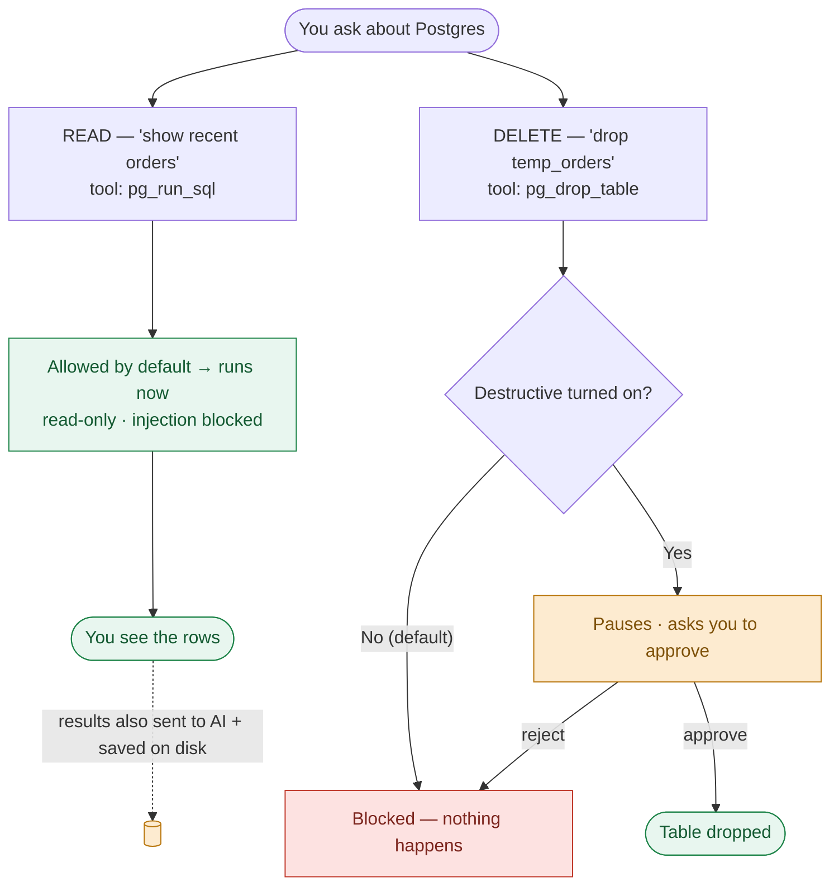
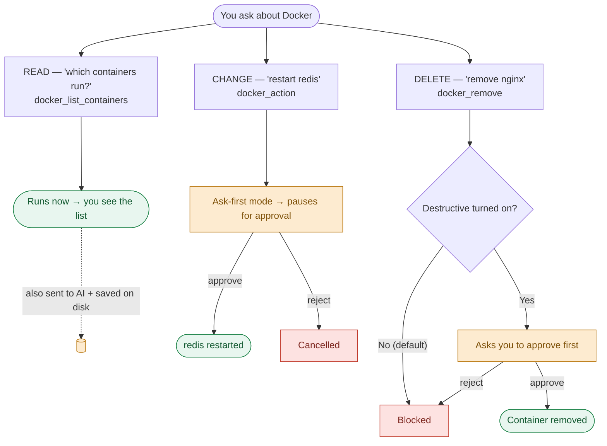

# Baklava AI Chat — Plain-English Security Summary

*A one-page summary of the full assessment. For the detailed version with diagrams, see `ai-chat-security-assessment.pdf`.*

## What it is

Baklava's AI chat is an assistant that can look at and act on your infrastructure (databases, Docker, Kubernetes, message queues, object storage). You type a request, it uses an AI model (Anthropic, OpenAI, or Google — your key) to figure out which tool to run, and it runs that tool against the connections you've set up. It's built as a **local, single-user developer tool** — like pgAdmin or Docker Desktop — that runs on your own machine.

## The good

- **Safe by default.** Out of the box the assistant can only *read*. It cannot create, change, or delete anything until you turn that on, per connection.
- **It asks before it acts.** Any write or delete pauses and waits for your approval (unless you explicitly switch a connection to "autonomous").
- **Real guardrails.** It blocks SQL injection tricks, runs queries in read-only mode, refuses database-write shortcuts, and hides Kubernetes secret values by default. These are tested.
- **Your passwords stay put.** Stored credentials are never shown in the browser and are never handed to the AI model.
- **There's an audit trail** of what the assistant did.

## What to watch out for

- **No login.** The app has no passwords or accounts of any kind, and by default it listens on all network interfaces. **If someone else can reach the port, they have full control of everything it's connected to.** Keep it on your own machine / loopback only.
- **Secrets are stored unencrypted.** Your database passwords, cloud keys, and AI key sit in plain text files in your home folder (locked to your user, but not encrypted). Anyone who can read your home folder — or a backup of it — gets them.
- **Your data is sent to the AI provider.** When the assistant reads something (query results, logs, file listings), that content is sent to the AI company you chose, and also saved to disk on your machine in plain text. Stored passwords are *not* sent, but whatever data lives *inside* your systems can be.

## Two quick examples (step by step)

These show the same pattern every time: **reading happens instantly; changing or deleting either asks you first or is switched off by default — but the results always go to the AI provider and onto your disk.**

### Example 1 — Postgres

You have a connection called **Local Postgres**.

**A read request — happens instantly:**

1. You type: *"Show me the 5 most recent rows in the orders table."*
2. The assistant picks the `pg_run_sql` tool and writes `SELECT * FROM orders ORDER BY created_at DESC LIMIT 5`.
3. Reading is allowed by default, so it runs right away — no approval needed.
4. Safety: the query runs in a **read-only** transaction and the assistant can't smuggle a second command in (a `;` is rejected), so it physically cannot change your data here.
5. The 5 rows come back and are shown to you. **Those rows are also sent to the AI provider** (so it can summarize them) **and saved to a chat file on your disk.**

**A delete request — asks first, or is blocked:**

1. You type: *"Drop the temp_orders table."*
2. The assistant picks `pg_drop_table` — a **destructive** tool.
3. If you haven't enabled destructive actions for this connection (the default), it's **blocked** and nothing happens.
4. If you have enabled it, the assistant **pauses and shows an approval card** — the table is dropped only after you click approve.

### Example 2 — Docker

You have a connection called **Local Docker**.

1. **Read — runs instantly.** You type *"Which containers are running?"* → the assistant uses `docker_list_containers` → you get the list straight away. (That list is also sent to the AI provider and saved on disk.)
2. **Change — asks first.** You type *"Restart the redis container."* → the assistant uses `docker_action` (a **write**) → in the default "ask-first" mode it **pauses for your approval**; redis restarts only after you click approve.
3. **Delete — off by default.** You type *"Remove the old nginx container."* → the assistant uses `docker_remove` (**destructive**) → **blocked** unless you've enabled destructive actions, and even then it asks first.

## Bottom line

| If you use it like this... | Verdict |
|---|---|
| One person, your own laptop, your own dev resources, your own AI key | **OK** — just know your data goes to the AI provider and secrets are unencrypted on disk |
| On a shared server or an open network port | **Don't** — no login means anyone who reaches it controls your systems |
| Pointed at real customer / production / sensitive data | **Not yet** — needs the fixes below first |

## Top things to fix before wider use

1. **Add a login** and keep it bound to your own machine (`127.0.0.1`).
2. **Encrypt the stored secrets** (use the OS keychain instead of plain files).
3. **Control what goes to the AI** — a data-handling agreement with the provider, and scrub sensitive data out of what's sent.

*Net: a thoughtful, well-guarded tool for a single developer's own machine. Not ready, as-is, for shared use or production data without the three fixes above.*
